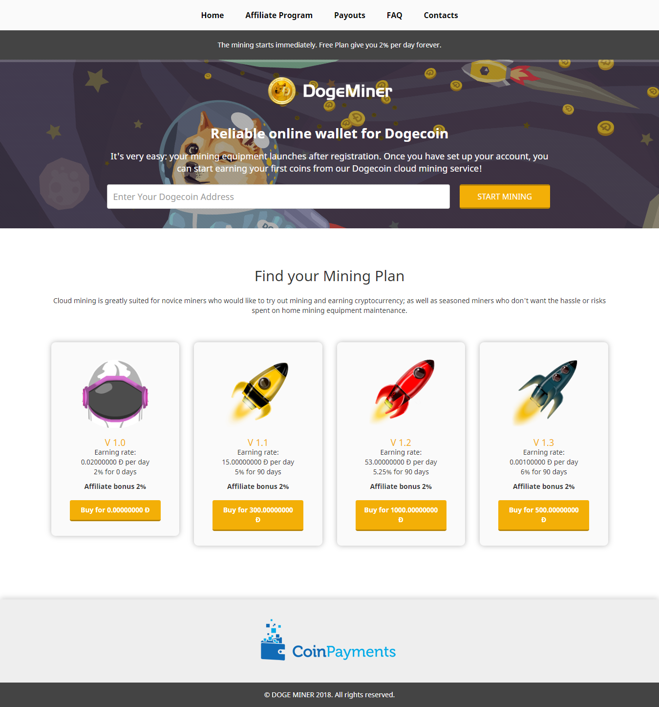

1. Uploads file inside SCRIPT folder to your hosting
2. Visit your domain, example : https://domain.com/install
3. Fill information
4. Login to admin panel
5. Turn on Coinpayments auto withdraw on https://domain.com/admin/Coinpayments and click install
6. Set up the Setting
7. Set up your coinpayments api to able auto withdraw https://www.coinpayments.net/acct-api-keys Click Edit Permissions
8. Checklist All Access, example : https://i.ibb.co/n3pS6VN/screencapture-coinpayments-net-index-php-2020-12-26-10-19-49.png
9. Go to Coinpayments Addons and try click on get withdraw history
10. Your cloud mining was ready
11. 
Donation : DR1G1FTb3sMqbpwBpREkL1uBaaTrdDQukw (Dogecoin) Ask Question, Buying theme and Addons :
